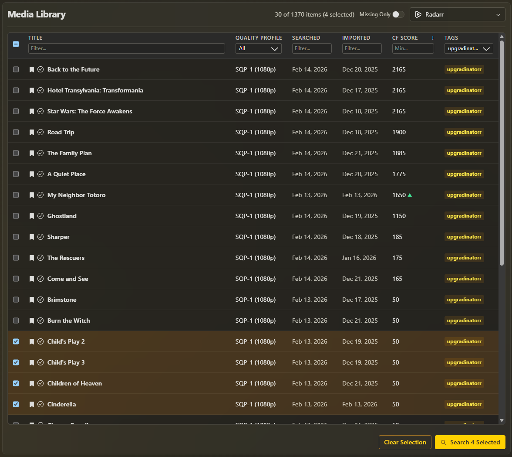
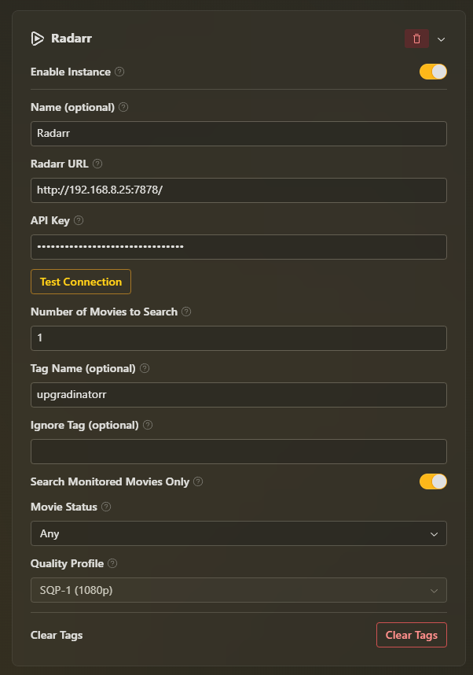
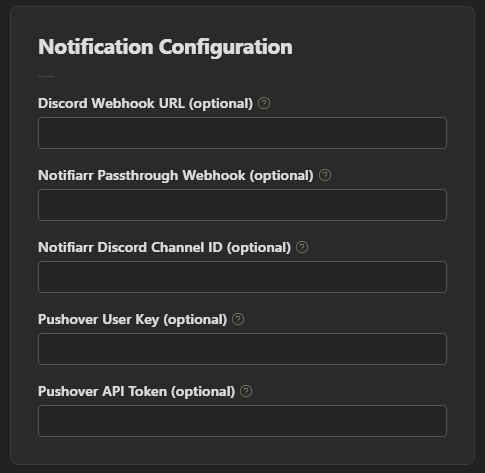

# scoutarr

Scoutarr automates media upgrades in your Starr applications (Radarr and Sonarr) by triggering manual searches for media items that meet your criteria and tagging what was triggered, so you can continuously chase better quality releases without babysitting your apps.

> **Note:** This project uses [Upgradinatorr](https://github.com/angrycuban13/Just-A-Bunch-Of-Starr-Scripts/tree/main/Upgradinatorr) as its foundation. We've created a modern UI and enhanced the functionality while maintaining the core concept.

## Screenshots



<table>
  <tr>
    <td></td>
    <td></td>
  </tr>
</table>

## Features

- 🎬 **Radarr Integration** – Automatically trigger focused manual searches for movies
- 📺 **Sonarr Integration** – Automatically trigger focused manual searches for series
- 🧠 **Smart Filtering** – Filter by monitored state, movie/series status (including an **Any** option), quality profile, and tags
- 🏷️ **Tag-Aware Workflow** – Only search untagged items, then tag everything that was triggered to avoid duplicates
- ⏱️ **Scheduler with Unattended Mode** – Run searches on a schedule; when unattended is enabled, tags are automatically cleared and re-applied when nothing matches, keeping things moving without manual intervention
- 📊 **Dashboard & Stats** – See recent triggers, per-app/instance totals, and a detailed log of what ran and when
- 🔔 **Notification Hooks** – Optional Discord and Notifiarr webhooks for external notifications
- 🎨 **Modern UI** – Built with Radix UI Themes
- 🐳 **Docker Support** – Easy deployment with Docker Compose
- ⚙️ **Clean Configuration** – Simple JSON-based configuration
- 📝 **Structured Logging** – Organized debugging logs with Winston

## Requirements

- Node.js 20+
- Docker (optional, for containerized deployment)

## Quick Start

### Development

1. Install dependencies:
```bash
npm install
```

2. Start development servers:
```bash
npm run dev
```

3. Open http://localhost:7291 in your browser

### Docker

1. Build and run with Docker Compose:
```bash
docker-compose up -d
```

2. Open http://localhost:5839 in your browser

## Configuration

Configuration is stored in `config/config.json`. On first run, the application will create a default configuration file based on `config/config.example.json`.

### Config Structure

```json
{
  "notifications": {
    "discordWebhook": "",
    "notifiarrPassthroughWebhook": "",
    "notifiarrPassthroughDiscordChannelId": "",
    "pushoverUserKey": "",
    "pushoverApiToken": ""
  },
  "applications": {
    "radarr": [],
    "sonarr": [],
    "lidarr": [],
    "readarr": []
  },
  "scheduler": {
    "enabled": false,
    "schedule": "0 */6 * * *",
    "unattended": false
  }
}
```

## How It Works

1. **Configure** – Set up your Radarr/Sonarr instances, filters, and scheduler in the Settings page.
2. **Preview** – The Dashboard shows a live preview of what the next scheduled run will trigger for each instance.
3. **Run** – Trigger a search manually from the Dashboard or let the scheduler run automatically.
4. **Tag** – Items that are searched are automatically tagged, and future runs only consider untagged items (unless unattended mode clears tags to keep searching).

The application filters items based on:
- **Monitored status**
- **Movie/Series status** (or **Any** to skip status filtering)
- **Quality profile**
- **Existing tags** (ignores items with the ignore tag, and only searches items without the main tag name)

## Logging

The application uses Winston for structured logging with organized, color-coded output:

- **Console Output**: Color-coded logs with timestamps for easy debugging
- **File Logs**: JSON-formatted logs saved to `logs/` directory:
  - `combined.log` - All logs
  - `error.log` - Error logs only
  - `exceptions.log` - Uncaught exceptions
  - `rejections.log` - Unhandled promise rejections

**Log Levels:**
- `error` - Errors that need attention
- `warn` - Warnings
- `info` - General information
- `http` - HTTP requests/responses
- `debug` - Detailed debugging information

**Environment Variable:**
- `LOG_LEVEL` - Set log level (default: `debug` in development, `info` in production)

## API Endpoints

- `GET /api/config` – Get current configuration
- `PUT /api/config` – Update configuration
- `POST /api/config/test/:app` – Test connection to an application
- `POST /api/config/clear-tags/:app/:instanceId` – Clear tags from all media in a specific instance
- `GET /api/status` – Get connection status for all applications and scheduler state
- `GET /api/status/scheduler/history` – Get scheduler run history
- `POST /api/status/scheduler/history/clear` – Clear scheduler run history
- `POST /api/search/run` – Run the search for all configured instances
- `POST /api/search/manual-run` – Preview what would be searched for each instance
- `GET /api/stats` – Get aggregated trigger statistics
- `POST /api/stats/reset` – Reset all statistics
- `POST /api/stats/clear-recent` – Clear the list of recent triggers

## License

MIT

